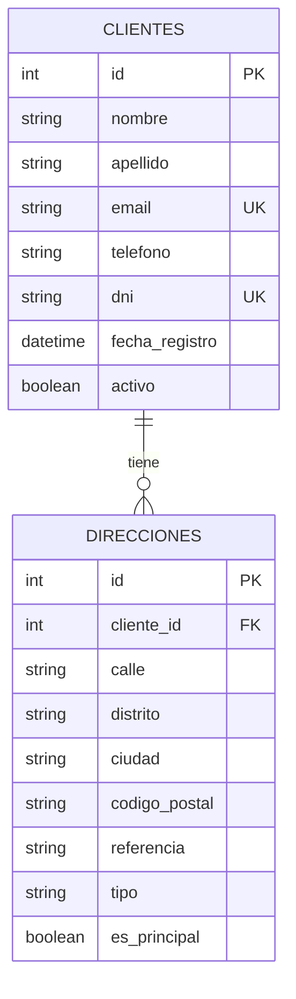

# Microservicio de Clientes — Sistema de Logística y Entregas

## Descripción del microservicio

El **Microservicio de Clientes** es una API REST responsable de administrar la información de los clientes del sistema de logística y sus direcciones de entrega.

El servicio permite registrar, consultar, actualizar y eliminar clientes, así como gestionar múltiples direcciones asociadas a cada uno. La información se almacena en una base de datos **MySQL** y es accedida mediante **SQLAlchemy**.

Dentro de la arquitectura del sistema, este microservicio expone sus datos únicamente mediante sus endpoints REST. Otros servicios, como el microservicio de Envíos, consultan las direcciones de los clientes a través de la API, sin acceder directamente a la base de datos.

La implementación incluye paginación y filtrado de clientes, validación de datos mediante Pydantic, control de correos electrónicos duplicados, configuración CORS mediante variables de entorno y validación de disponibilidad de la base de datos durante el arranque del servicio.

---

## Diagrama Entidad/Relación



La relación entre las entidades es **1:N**: un cliente puede registrar varias direcciones, mientras que cada dirección pertenece a un único cliente.

La clave foránea `cliente_id` referencia a `clientes.id`. La relación utiliza eliminación en cascada, por lo que al eliminar un cliente también se eliminan sus direcciones asociadas.

---

## Principales endpoints

### Clientes

| Método | Endpoint | Descripción |
|---|---|---|
| `GET` | `/clientes` | Lista clientes con paginación y filtro opcional por estado activo/inactivo. |
| `GET` | `/clientes/{cliente_id}` | Obtiene el detalle de un cliente junto con sus direcciones. |
| `POST` | `/clientes` | Registra un nuevo cliente y, opcionalmente, sus direcciones iniciales. |
| `PUT` | `/clientes/{cliente_id}` | Actualiza los datos de un cliente existente. |
| `DELETE` | `/clientes/{cliente_id}` | Elimina un cliente y sus direcciones asociadas. |

### Direcciones

| Método | Endpoint | Descripción |
|---|---|---|
| `GET` | `/clientes/{cliente_id}/direcciones` | Lista las direcciones registradas de un cliente. |
| `POST` | `/clientes/{cliente_id}/direcciones` | Registra una nueva dirección para un cliente. |
| `PUT` | `/direcciones/{direccion_id}` | Actualiza una dirección existente. |
| `DELETE` | `/direcciones/{direccion_id}` | Elimina una dirección. |

### Estado del servicio

| Método | Endpoint | Descripción |
|---|---|---|
| `GET` | `/` | Verifica que el microservicio se encuentre operativo. |

La documentación interactiva de la API se encuentra disponible en:

- **Swagger UI:** `/docs`
- **ReDoc:** `/redoc`

---

## Tecnologías

| Tecnología | Uso |
|---|---|
| **Python 3.11** | Lenguaje principal del microservicio. |
| **FastAPI** | Desarrollo y exposición de la API REST. |
| **SQLAlchemy** | Acceso y mapeo de las entidades de la base de datos. |
| **MySQL** | Persistencia de clientes y direcciones. |
| **PyMySQL** | Driver de conexión entre Python y MySQL. |
| **Pydantic** | Validación y serialización de datos de entrada y salida. |
| **Uvicorn** | Servidor ASGI utilizado para ejecutar FastAPI. |
| **Swagger / OpenAPI** | Documentación interactiva de los endpoints. |
| **Docker** | Empaquetado y ejecución del microservicio en contenedores. |

---

## Documentación Docker

El microservicio está preparado para ejecutarse dentro de un contenedor Docker. La imagen utiliza **Python 3.11 Slim**, instala las dependencias del proyecto y ejecuta la API mediante Uvicorn en el puerto interno `8000`.

### 1. Variables de entorno

Crear un archivo `.env` a partir de `.env.example` y configurar la conexión a MySQL:

```env
DB_USER=root
DB_PASSWORD=root123
DB_HOST=host.docker.internal
DB_PORT=3306
DB_NAME=clientes_db

CORS_ALLOWED_ORIGINS=*
```

Para un despliegue en infraestructura remota, `DB_HOST` debe apuntar a la dirección privada de la máquina que contiene la base de datos.

En producción, `CORS_ALLOWED_ORIGINS` debe configurarse con los dominios autorizados en lugar de utilizar `*`.

### 2. Construir la imagen

Desde la raíz del repositorio:

```bash
docker build -t svc-clients .
```

### 3. Ejecutar el contenedor

```bash
docker run -d \
  --name ms-clientes \
  --env-file .env \
  -p 8001:8000 \
  svc-clients
```

El puerto `8000` corresponde al puerto interno del contenedor y `8001` al puerto utilizado para acceder al servicio desde el host.

### 4. Verificar el servicio

```text
http://localhost:8001/
```

Swagger UI:

```text
http://localhost:8001/docs
```

ReDoc:

```text
http://localhost:8001/redoc
```

### 5. Comandos útiles

Verificar el contenedor en ejecución:

```bash
docker ps
```

Revisar los logs:

```bash
docker logs ms-clientes
```

Detener el contenedor:

```bash
docker stop ms-clientes
```

Eliminar el contenedor:

```bash
docker rm ms-clientes
```
